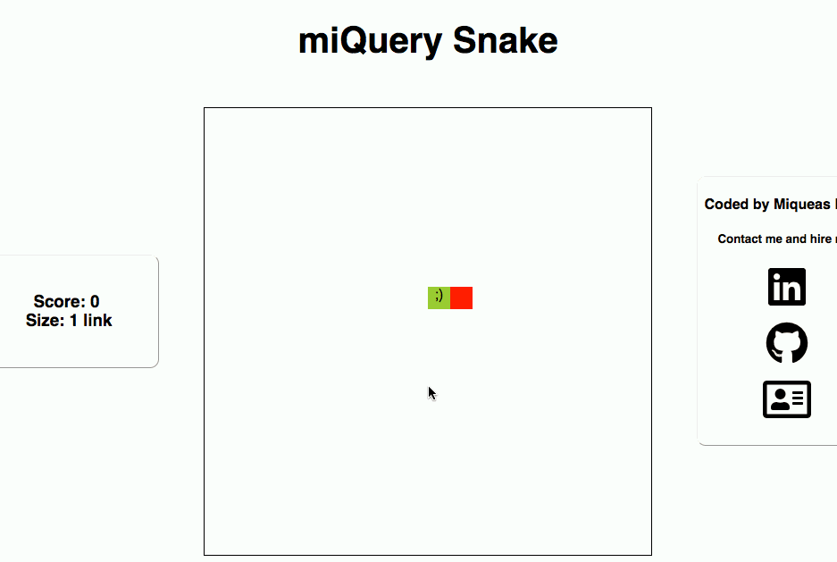

# miQuery Snake

[play live](https://micahbello.github.io/miQuery_snake/)

### Background

miQuery Snake is a rendition of the classic computer game 'Snake' created with HTML5, JS and a custom-built JS library (inspired by jQuery) called 'miQuery' for DOM manipulation.



### Technologies
* `JavaScript` for game logic
* `miQuery` JS library for DOM manipulation
* `CSS` for styling

### miQuery API

miQuery is a custom built JS library inspired by jQuery. Some of the basic functions of miQuery are the following-

`$l` - like jQuery's `$`, this is used to select elements with CSS selectors. Wrapping CSS selectors with `$l()` will return a `DOMNodeCollection`. miQuery methods can then be called on this `DOMNodeCollection`.

`html` - calling `.html()` with no argument on a `DOMNodeCollection` will return the HTML contents of the first element in the collection. Calling the same method with an argument will change the HMTL contents of all elements in the collection to that argument.

`addClass` - calling `.addClass()` with a class name as its argument will add said class name to the class attribute of each element in a collection.

`on` - calling `.on()` with two arguments- an event and a callback function- will trigger that callback when such event occurs on any of the elements in a collection.

other methods include, `empty`, `append`, `children`, `parent`, `find`, `remove`, `off`, `attr`, `removeClass`. Each of these have the same functions as that of their jQuery versions.

### Implementation for Snake

miQuery Snake is played on a grid of 20 x 20 `<li>` elements. To accomplish this, `<ul>` elements are appended to a section designated for the game, and as each `<ul>` is appended, the appropriate number of` <li>` elements are appended to each `<ul>`.

```Javascript
$l(".snake-game").html(" ");

this.board.snake.move();

for (let i = 0; i < this.board.grid[this.board.grid.length - 1][1]; i++) {
  $l(".snake-game").append("<ul>")
}

const ulListItems = () => {
  let items = "";

  for (let i = 0; i < this.board.grid[this.board.grid.length - 1][1]; i++) {
    items += "<li>";
  }
  return items;
}

$l(".snake-game ul").append(ulListItems());

let coord1 = 0 // applies to horizontal
let coord2 = 0; // applies to vertical
$l(".snake-game li").elements.forEach(element => {
  element.coord = [coord1, coord2];

  if (this.coordsEquate(element.coord, this.board.snake.segments)) {
    element.className = "snake-segment";
    if (this.board.snake.segments[0][0] === element.coord[0]
      && this.board.snake.segments[0][1] === element.coord[1]) {
        element.textContent = ";)";
    }
  }
```

As can be seen above, each element is given a coordinate after being created. This is what allows for the illusion that the snake is moving around the grid. Upon every render of the grid, the coordinates of the snake segments are compared with every grid coordinate. Those grid coordinates that match with the snake segment coordinates receive the class name "snake-segment" and due to the CSS properties of this class, become rendered as green squares.

To make sure each snake segment traverses the grid coordinates of the segment ahead of it, upon each render a new array of snake segments is created, assuring that each new segment is in reality the segment that was before it in the previous array.

```Javascript
  move() {
    let newSegments = [];
    if (this.direction === "up") {
      for (let i = 0; i < this.segments.length; i ++) {
        if (i === 0) {
          let coord1 = this.segments[i][0];
          let coord2 = this.segments[i][1] - 1;

          let newSegment = [coord1, coord2];
          newSegments[i] = newSegment;
          this.turning = false;
        } else {
          newSegments[i] = this.segments[i - 1];
        }
      }
    } else if (this.direction === "down") {
      for (let i = 0; i < this.segments.length; i ++) {
        if (i === 0) {
          let coord1 = this.segments[i][0];
          let coord2 = this.segments[i][1] + 1;

          let newSegment = [coord1, coord2];
          newSegments[i] = newSegment;
          this.turning = false;
        } else {
          newSegments[i] = this.segments[i - 1];
        }
      }
    } else if (this.direction === "left") {
      for (let i = 0; i < this.segments.length; i ++) {
        if (i === 0) {
          let coord1 = this.segments[i][0] - 1;
          let coord2 = this.segments[i][1];

          let newSegment = [coord1, coord2];
          newSegments[i] = newSegment;
          this.turning = false;
        } else {
          newSegments[i] = this.segments[i - 1];
        }
      }
    } else if (this.direction === "right") {

      for (let i = 0; i < this.segments.length; i ++) {
        if (i === 0) {
          let coord1 = this.segments[i][0] + 1;
          let coord2 = this.segments[i][1];

          let newSegment = [coord1, coord2];
          newSegments[i] = newSegment;
          this.turning = false;
        } else {
          newSegments[i] = this.segments[i - 1];
        }
      }
    }

    this.segments = newSegments;
  }

```
